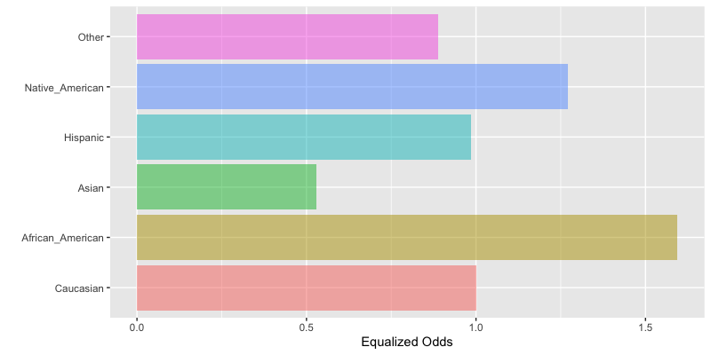
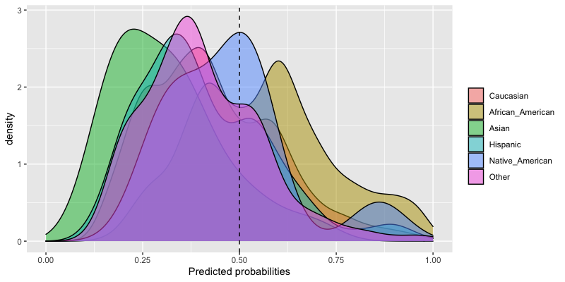

# fairness: measuring algorithmic fairness in R

---

[](https://www.repostatus.org/#active)
[](http://choosealicense.com/licenses/mit/)
[](https://travis-ci.com/kozodoi/Fairness)
[](https://cran.rstudio.com/web/packages/fairness/index.html)
[](https://cran.rstudio.com/web/packages/fairness/index.html)

---

[](https://cran.r-project.org/)
[](https://www.r-pkg.org/badges/version/fairness)
[](commits/master)

---

## Package overview

The `fairness` R package offers tools to calculate metrics of algorithmic fairness across different sensitive groups. The metrics are computed based on model predictions in a binary classification task. The package also provides opportunities to visualize and compare other prediction metrics between the sensitive groups.

The package contains functions to compute the commonly used fair machine learning metrics such as:   
- Demographic parity
- Proportional parity
- Equalized odds
- Predictive rate parity

In addition, the following metrics are implemented:    
- False positive rate parity
- False negative rate parity
- Accuracy parity
- Negative predictive value parity
- Specificity parity
- ROC AUC comparison
- MCC comparison

The comprehensive tutorial on using the package is provided in [this blogpost](https://kozodoi.me/r/fairness/packages/2020/05/01/fairness-tutorial.html). We recommend that you go through the tutorial, as it contains a more in-depth description of the fairness package compared to this README. You will also find a brief tutorial in the fairness [vignette](https://github.com/kozodoi/fairness/blob/master/vignettes/fairness.Rmd):

```r
vignette('fairness')
```

## Installation

You can install the latest stable package version from [CRAN](https://cran.r-project.org/package=fairness) by running:

```r
install.packages('fairness')
library(fairness)
```

You may also install the development version from Github:

```r
library(devtools)
devtools::install_github('kozodoi/fairness')
library(fairness)
```

## Brief tutorial

### Loading the COMPAS sample dataset

```r
data('compas')
```

The data already contains all variables necessary to run all parity metrics. In case you set up your own predictive model, you will need to concatenate predicted probabilities or predictions (0/1) to your original dataset or supply them as a vector to the corresponding metric function.

### Computing a fairness metric

All fairness metrics are implemented as separate functions with the same structure of inputs including the outcome variable, model predictions and a sensitive group feature.

```r
compas$Two_yr_Recidivism_01 <- ifelse(compas$Two_yr_Recidivism == 'yes', 1, 0)
equal_odds(data    = compas,
           outcome = 'Two_yr_Recidivism_01',
           probs   = 'probability',
           group   = 'ethnicity',
           cutoff  = 0.5,
           base    = 'Caucasian')
```

### Examining the output

```
#>                Caucasian African_American     Asian Hispanic
#> Sensitivity       0.4720           0.7526    0.2500   0.4656
#> Equalized odds    1.0000           1.5943    0.5296   0.9864
#> Group size     2103.0000        3175.0000   31.0000 509.0000
#>                Native_American     Other
#> Sensitivity             0.6000    0.4194
#> Equalized odds          1.2711    0.8884
#> Group size             11.0000  343.0000
```

Bar chart for the equalized odds metric:    


Predicted probability plot for all subgroups:    



## Citing the package

To cite this package in scientific publications, please use the following query to generate a reference as a text or a BibTeX entry:
```r
citation('fairness')
```
> Nikita Kozodoi and Tibor V. Varga (2020). fairness: Algorithmic Fairness Metrics. R package version 1.2.1.

```
 @Manual{,
    title = {fairness: Algorithmic Fairness Metrics},
    author = {Nikita Kozodoi and Tibor {V. Varga}},
    year = {2021},
    note = {R package version 1.2.1},
    url = {https://CRAN.R-project.org/package=fairness},
  }
```


## Dependencies

Installation requires R 3.6+ and the following packages:
- [caret](https://cran.r-project.org/package=caret)
- [ggplot2](https://cran.r-project.org/package=ggplot2)
- [pROC](https://cran.r-project.org/package=pROC)
- [e1071](https://cran.r-project.org/package=e1071)


## Acknowledgments

- Calders, T., & Verwer, S. (2010). Three naive Bayes approaches for discrimination-free classification. Data Mining and Knowledge Discovery, 21(2), 277-292.
- Chouldechova, A. (2017). Fair prediction with disparate impact: A study of bias in recidivism prediction instruments. Big data, 5(2), 153-163.
- Feldman, M., Friedler, S. A., Moeller, J., Scheidegger, C., & Venkatasubramanian, S. (2015, August). Certifying and removing disparate impact. In Proceedings of the 21th ACM SIGKDD International Conference on Knowledge Discovery and Data Mining (pp. 259-268). ACM.
- Friedler, S. A., Scheidegger, C., Venkatasubramanian, S., Choudhary, S., Hamilton, E. P., & Roth, D. (2018). A comparative study of fairness-enhancing interventions in machine learning. arXiv preprint arXiv:1802.04422.
- Zafar, M. B., Valera, I., Gomez Rodriguez, M., & Gummadi, K. P. (2017, April). Fairness beyond disparate treatment & disparate impact: Learning classification without disparate mistreatment. In Proceedings of the 26th International Conference on World Wide Web (pp. 1171-1180). International World Wide Web Conferences Steering Committee.


## Issues & questions

In case you need help or advice on fairness metrics or you want to report an issue, please do so in a reproducible example at the corresponding [GitHub page](https://github.com/kozodoi/fairness/issues).
